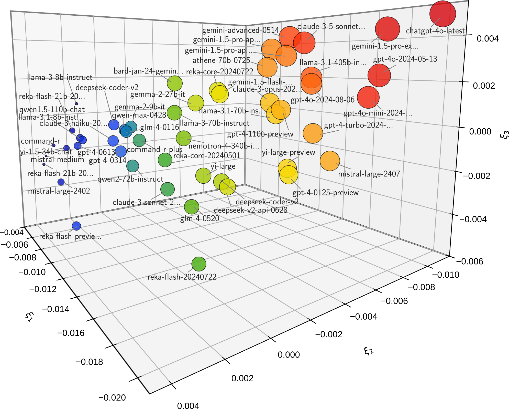

.. image:: docs/source/_static/images/icons/logo-leaderbot-light.png
    :align: left
    :width: 240
    :class: custom-dark

*leaderbot* is a python package that provides a **leader**\ board for
chat\ **bot**\ s based on `Chatbot Arena <https://lmarena.ai/>`_ project.

Install
=======

Install with ``pip``:

.. code-block::

    pip install leaderbot

Alternatively, clone the source code and install with

.. code-block::

    cd source_dir
    pip install .

Documentation
=============

Documentation is available at `leaderbot.org <https://leaderbot.org/>`__.

Quick Usage
===========

The package provides several statistical models (see `API References <https://leaderbot.org/api.html>`__ for details). In the example below, we use ``leaderbot.models.Davidson`` class to
create a statistical model based on Davidson's method. However, there are several more methods available in the API, and working with them is similar. Here we will demonstrate some of the functionalities of the models, but the full list is available in the documentation.

Create and Train a Model
------------------------

.. code-block:: python

    >>> from leaderbot.data import load
    >>> from leaderbot.models import Davidson

    >>> # Create a model
    >>> data = load()
    >>> model = Davidson(data)

    >>> # Train the model
    >>> model.train()

Leaderboard Table
-----------------

To print leaderboard table of the chatbot agents, use
``leaderbot.models.Davidson.leaderboard`` function:

.. code-block:: python

    >>> # Leaderboard table
    >>> model.leaderboard(max_rank=15)

The above code prints the table below:

::

    +---------------------------+--------+--------+---------------+---------------+
    |                           |        |    num |   observed    |   predicted   |
    | rnk  agent                |  score |  match | win loss  tie | win loss  tie |
    +---------------------------+--------+--------+---------------+---------------+
    |   1. chatgpt-4o-latest    | +0.221 |  11798 | 53%  23%  24% | 55%  25%  20% |
    |   2. gemini-1.5-pro-ex... | +0.200 |  16700 | 51%  26%  23% | 52%  27%  20% |
    |   3. gpt-4o-2024-05-13    | +0.181 |  66560 | 51%  26%  23% | 52%  28%  20% |
    |   4. gpt-4o-mini-2024-... | +0.171 |  15929 | 46%  29%  25% | 48%  31%  21% |
    |   5. claude-3-5-sonnet... | +0.170 |  40587 | 47%  31%  22% | 48%  32%  21% |
    |   6. gemini-advanced-0514 | +0.167 |  44319 | 49%  29%  22% | 50%  30%  21% |
    |   7. llama-3.1-405b-in... | +0.161 |  15680 | 44%  32%  24% | 45%  34%  21% |
    |   8. gpt-4o-2024-08-06    | +0.159 |   7796 | 43%  32%  25% | 45%  34%  21% |
    |   9. gemini-1.5-pro-ap... | +0.159 |  57941 | 47%  31%  22% | 48%  32%  21% |
    |  10. gemini-1.5-pro-ap... | +0.156 |  48381 | 52%  28%  20% | 52%  28%  20% |
    |  11. athene-70b-0725      | +0.149 |   9125 | 43%  35%  22% | 43%  36%  21% |
    |  12. gpt-4-turbo-2024-... | +0.148 |  73106 | 47%  29%  24% | 49%  31%  21% |
    |  13. mistral-large-2407   | +0.147 |   9309 | 41%  35%  25% | 43%  37%  21% |
    |  14. llama-3.1-70b-ins... | +0.143 |  10946 | 41%  36%  22% | 42%  37%  21% |
    |  15. claude-3-opus-202... | +0.141 | 134831 | 49%  29%  21% | 50%  30%  20% |
    +---------------------------+--------+--------+---------------+---------------+

Scores
------

The scores versus rank can be plotted by ``leaderbot.Davidson.plot_scores``
function:

.. code-block:: python

    >>> model.plot_scores(max_rank=30)

.. image:: docs/source/_static/images/plots/scores.png
    :align: center
    :class: custom-dark

Visualize Correlation
---------------------

The correlation of the chatbot performances can be visualized with
``leaderbot.models.Davidson.map_dissimilairy`` using various methods. Here is an
example with the Kernel PCA method:

.. code-block:: python

    >>> # Plot kernel PCA
    >>> model.map_dissimilarity(max_rank=50)

The above code produces plot below demonstrating the Kernel PCA projection on
three principal axes:

Make Inference and Prediction
-----------------------------

Once a model is trained, you can make inference on the probabilities of win,
loss, or tie for a pair of agents using ``leaderbot.models.Davidson.infer``
method:

.. code-block:: python

    >>> # Create a list of three matches using pairs of indices of agents
    >>> matches = zip((0, 1, 2), (1, 2, 0))

    >>> # Make inference
    >>> prob = model.infer(matches)

    >>> # Make prediction
    >>> pred = model.predict(mathces)

Model Evaluation
----------------

Performance of multiple models can be compared as follows. First, create a
list of models and train them.

.. code-block:: python

    >>> import leaderbot as lb

    >>> # Obtain data
    >>> data = lb.data.load()

    >>> # Split data to training and test data
    >>> training_data, test_data = lb.data.split(data, test_ratio=0.2)

    >>> # Create a list of models to compare
    >>> models = [
    ...    lb.models.BradleyTerry(training_data),
    ...    lb.models.BradleyTerryScaled(training_data),
    ...    lb.models.BradleyTerryScaledR(training_data),
    ...    lb.models.RaoKupper(training_data),
    ...    lb.models.RaoKupperScaled(training_data),
    ...    lb.models.RaoKupperScaledR(training_data),
    ...    lb.models.Davidson(training_data),
    ...    lb.models.DavidsonScaled(training_data),
    ...    lb.models.DavidsonScaledR(training_data)
    ... ]

    >>> # Train models
    >>> for model in models:
    ...    model.train()

Model Selection
...............

Model selection can be performed with ``leaderbot.evaluate.model_selection``:

.. code-block:: python

    >>> # Evaluate models
    >>> metrics = lb.evaluate.model_selection(models, report=True)

The above model evaluation performs the analysis via various metric including
the negative log-likelihood (NLL), cross entropy loss (CEL), Akaike information
criterion (AIC), and Bayesian information criterion (BIC), and prints a report
these metrics the following table:

::

    +-----------------------+---------+--------+--------+--------+---------+
    | model                 | # param | NLL    | CEL    | AIC    | BIC     |
    +-----------------------+---------+--------+--------+--------+---------+
    | BradleyTerry          |     129 | 0.6544 |    inf | 256.69 | 1020.94 |
    | BradleyTerryScaled    |     258 | 0.6542 |    inf | 514.69 | 2043.20 |
    | BradleyTerryScaledR   |     259 | 0.6542 |    inf | 516.69 | 2051.12 |
    | RaoKupper             |     130 | 1.0080 | 1.0080 | 257.98 | 1028.16 |
    | RaoKupperScaled       |     259 | 1.0077 | 1.0077 | 515.98 | 2050.41 |
    | RaoKupperScaledR      |     260 | 1.0077 | 1.0077 | 517.98 | 2058.34 |
    | Davidson              |     130 | 1.0085 | 1.0085 | 257.98 | 1028.16 |
    | DavidsonScaled        |     259 | 1.0083 | 1.0083 | 515.98 | 2050.41 |
    | DavidsonScaledR       |     260 | 1.0083 | 1.0083 | 517.98 | 2058.34 |
    +-----------------------+---------+--------+--------+--------+---------+

Goodness of Fit
...............

The goodness of fit test can be performed with
``leaderbot.evaluate.goodness_of_fit``:

.. code-block:: python

    >>> # Evaluate models
    >>> metrics = lb.evaluate.goodness_of_fit(models, report=True)

The above model evaluation performs the analysis of the goodness of fit using
mean absolute error (MAE), KL divergence (KLD), Jensen-Shannon divergence
(JSD), and prints the following summary table:

::

    +-----------------------+----------------------------+--------+--------+
    |                       |    Mean Absolute Error     |        |        |
    | model                 |   win   loss    tie    all | KLD    | JSD %  |
    +-----------------------+----------------------------+--------+--------+
    | BradleyTerry          | 10.98  10.98  -----  10.98 | 0.0199 | 0.5687 |
    | BradleyTerryScaled    | 10.44  10.44  -----  10.44 | 0.0189 | 0.5409 |
    | BradleyTerryScaledR   | 10.42  10.42  -----  10.42 | 0.0188 | 0.5396 |
    | RaoKupper             |  8.77   9.10  11.66   9.84 | 0.0331 | 0.9176 |
    | RaoKupperScaled       |  8.47   8.55  11.67   9.56 | 0.0322 | 0.8919 |
    | RaoKupperScaledR      |  8.40   8.56  11.66   9.54 | 0.0322 | 0.8949 |
    | Davidson              |  8.91   9.36  12.40  10.22 | 0.0341 | 0.9445 |
    | DavidsonScaled        |  8.75   8.74  12.47   9.99 | 0.0332 | 0.9217 |
    | DavidsonScaledR       |  8.73   8.72  12.48   9.98 | 0.0331 | 0.9201 |
    +-----------------------+----------------------------+--------+--------+

Generalization
..............

The generalization test can be performed with
``leaderbot.evaluate.generalization``:

.. code-block:: python

    >>> # Evaluate models
    >>> metrics = lb.evaluate.generalization(models, test_data, report=True)

The above model evaluation computes prediction error via mean absolute
error (MAE), KL divergence (KLD), Jensen-Shannon divergence
(JSD), and prints the following summary table:

::

    +-----------------------+----------------------------+--------+--------+
    |                       |    Mean Absolute Error     |        |        |
    | model                 |   win   loss    tie    all | KLD    | JSD %  |
    +-----------------------+----------------------------+--------+--------+
    | BradleyTerry          | 10.98  10.98  -----  10.98 | 0.0199 | 0.5687 |
    | BradleyTerryScaled    | 10.44  10.44  -----  10.44 | 0.0189 | 0.5409 |
    | BradleyTerryScaledR   | 10.42  10.42  -----  10.42 | 0.0188 | 0.5396 |
    | RaoKupper             |  8.77   9.10  11.66   9.84 | 0.0331 | 0.9176 |
    | RaoKupperScaled       |  8.47   8.55  11.67   9.56 | 0.0322 | 0.8919 |
    | RaoKupperScaledR      |  8.40   8.56  11.66   9.54 | 0.0322 | 0.8949 |
    | Davidson              |  8.91   9.36  12.40  10.22 | 0.0341 | 0.9445 |
    | DavidsonScaled        |  8.75   8.74  12.47   9.99 | 0.0332 | 0.9217 |
    | DavidsonScaledR       |  8.73   8.72  12.48   9.98 | 0.0331 | 0.9201 |
    +-----------------------+----------------------------+--------+--------+

Comparing Ranking of Models
...........................

Ranking of various models can be compared using
``leaderbot.evaluate.comopare_rank`` function:

.. code-block:: python

    >>> import leaderbot as lb
    >>> from leaderbot.models import BradleyTerryFactor as BTF
    >>> from leaderbot.models import RaoKupperFactor as RKF
    >>> from leaderbot.models import DavidsonFactor as DVF

    >>> # Load data
    >>> data = lb.data.load()

    >>> # Create a list of models to compare
    >>> models = [
    ...     BTF(data, n_cov_factors=0),
    ...     BTF(data, n_cov_factors=3),
    ...     RKF(data, n_cov_factors=0, n_tie_factors=0),
    ...     RKF(data, n_cov_factors=0, n_tie_factors=1),
    ...     RKF(data, n_cov_factors=0, n_tie_factors=3),
    ...     DVF(data, n_cov_factors=0, n_tie_factors=0),
    ...     DVF(data, n_cov_factors=0, n_tie_factors=1),
    ...     DVF(data, n_cov_factors=0, n_tie_factors=3)
    ... ]

    >>> # Train the models
    >>> for model in models: model.train()

    >>> # Compare ranking of the models
    >>> lb.evaluate.compare_ranks(models, rank_range=[40, 70])

The above code produces plot below.

.. image:: docs/source/_static/images/plots/bump_chart.png
    :align: center
    :class: custom-dark

Test
====

You may test the package with `tox <https://tox.wiki/>`__:

.. code-block::

    cd source_dir
    tox

Alternatively, test with `pytest <https://pytest.org>`__:

.. code-block::

    cd source_dir
    pytest

How to Contribute
=================

We welcome contributions via GitHub's pull request. Developers should review
our [Contributing Guidelines](CONTRIBUTING.rst) before submitting their code.
If you do not feel comfortable modifying the code, we also welcome feature
requests and bug reports.

How to Cite
===========

* Ameli, S., Zhuang, S., Stoica, I., & Mahoney, M. W. (2024). `A Statistical Framework for Ranking LLM-Based Chatbots <https://arxiv.org/abs/2412.18407>`__. *arXiv Preprint arXiv:2412.18407*.

  .. code::

      @article{ameli-2024,
          title={A Statistical Framework for Ranking LLM-Based Chatbots}, 
          author={Siavash Ameli and Siyuan Zhuang and Ion Stoica and Michael W. Mahoney},
          year={2024},
          journal={arXiv preprint arXiv:2412.18407},
          eprint={2412.18407},
          archivePrefix={arXiv},
          primaryClass={stat.ML},
          url={https://arxiv.org/abs/2412.18407}, 
      }

License
=======

This project uses a BSD 3-clause license in hopes that it will be accessible to
most projects. If you require a different license, please raise an issue and we
will consider a dual license.
