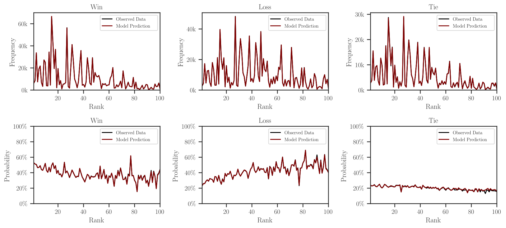

.. module:: leaderbot

|project| Documentation
***********************

|project| is a python package that provides a **leader**\ board for
chat\ **bot**\ s based on `Chatbot Arena <https://lmarena.ai/>`_ project.

.. .. grid:: 4
..
..     .. grid-item-card:: Install
..         :link: install
..         :link-type: ref
..         :text-align: center
..         :class-card: custom-card-link
..
..     .. grid-item-card:: User Guide
..         :link: user_guide
..         :link-type: ref
..         :text-align: center
..         :class-card: custom-card-link
..
..     .. grid-item-card:: API reference
..         :link: api
..         :link-type: ref
..         :text-align: center
..         :class-card: custom-card-link
..
..     .. grid-item-card:: Publications
..         :link: index_publications
..         :link-type: ref
..         :text-align: center
..         :class-card: custom-card-link

Install
=======

Install with ``pip``:

.. prompt:: bash
    
    pip install leaderbot

Alternatively, clone the source code and install with

.. prompt:: bash
   
    cd source_dir
    pip install .

Quick Usage
===========

The package provides several statistical models (see
:ref:`API reference <api>` for details). In the example below, we use
:class:`leaderbot.models.Davidson` class to build a model. However, working
with other models is similar.

Create and Train a Model
------------------------

.. code-block:: python

    >>> from leaderbot.data import load
    >>> from leaderbot.models import Davidson

    >>> # Create a model
    >>> data = load()
    >>> model = Davidson(data)

    >>> # Train the model
    >>> model.train()

Leaderboard Table
-----------------

To print leaderboard table of the chatbot agents, use
:func:`leaderbot.models.Davidson.leaderboard` function:

.. code-block:: python

    >>> # Leaderboard table
    >>> model.leaderboard(plot=True)

The above code prints the table below:

.. literalinclude:: _static/data/leaderboard.txt
    :language: none

The above code also produces the following plot of the frequencies and
probabilities of win, loss, and tie of the matches.

Score Plot
----------

The scores versus rank can be plotted by
:func:`leaderbot.models.Davidson.plot_scores` function:

.. code-block:: python

    >>> model.plot_scores(max_rank=30)

.. image:: _static/images/plots/scores.png
    :align: center
    :class: custom-dark

Visualize Correlation
---------------------

The correlation of the chatbot performances can be visualized with
:func:`leaderbot.models.Davidson.visualize` using various methods. Here is an
example with the Kernel PCA method:

.. code-block:: python

    >>> # Plot kernel PCA
    >>> model.visualize(max_rank=50)

The above code produces plot below demonstrating the Kernel PCA projection on
three principal axes:

.. image:: _static/images/plots/kpca.png
    :align: center
    :class: custom-dark

Match Matrices
--------------

The match matrices of the counts or densities of wins and ties can be
visualized with :func:`leaderbot.models.Davidson.match_matrix` function:

.. code-block:: python

    >>> # Match matrix for probability density of win and tie
    >>> model.match_matrix(max_rank=20, density=True)

The same plot for the counts (as opposed to density) of the win and ties are
plotted as follows:

.. code-block:: python

    >>> # Match matrix for frequency of win and tie
    >>> model.match_matrix(max_rank=20, density=False)

Make Inference and Prediction
-----------------------------

Once a model is trained, you can make inference on the probabilities of win,
loss, or tie for a pair of agents using :func:`leaderbot.models.Davidson.infer`
method:

.. code-block:: python

    >>> # Create a list of three matches using pairs of indices of agents
    >>> matches = zip((0, 1, 2), (1, 2, 0))

    >>> # Make inference
    >>> prob = model.infer(matches)

    >>> # Make prediction
    >>> pred = model.predict(mathces)

Model Evaluation
----------------

Performance of multiple models can be compared as follows. First, create a
list of models and train them.

.. code-block:: python

    >>> import leaderbot as lb

    >>> # Obtain data
    >>> data = lb.data.load()

    >>> # Split data to training and test data
    >>> training_data, test_data = lb.data.split(data, test_ratio=0.2)

    >>> # Create a list of models to compare
    >>> models = [
    ...    lb.models.BradleyTerry(training_data),
    ...    lb.models.BradleyTerryScaled(training_data),
    ...    lb.models.BradleyTerryScaledR(training_data),
    ...    lb.models.RaoKupper(training_data),
    ...    lb.models.RaoKupperScaled(training_data),
    ...    lb.models.RaoKupperScaledR(training_data),
    ...    lb.models.Davidson(training_data),
    ...    lb.models.DavidsonScaled(training_data),
    ...    lb.models.DavidsonScaledR(training_data)
    ... ]

    >>> # Train models
    >>> for model in models:
    ...    model.train()

Model Selection
...............

Model selection can be performed with
:func:`leaderbot.evaluate.model_selection`:

.. code-block:: python

    >>> # Evaluate models
    >>> metrics = lb.evaluate.model_selection(models, report=True)

The above model evaluation performs the analysis via various metric including
the negative log-likelihood (NLL), cross entropy loss (CEL), Akaike information
criterion (AIC), and Bayesian information criterion (BIC), and prints a report
these metrics the following table:

.. literalinclude:: _static/data/model_selection.txt
    :language: none

Goodness of Fit
...............

The goodness of fit test can be performed with
:func:`leaderbot.evaluate.goodness_of_fit`:

.. code-block:: python

    >>> # Evaluate models
    >>> metrics = lb.evaluate.goodness_of_fit(models, report=True)

The above model evaluation performs the analysis of the goodness of fit using
mean absolute error (MAE), KL divergence (KLD), Jensen-Shannon divergence
(JSD), and prints the following summary table:

.. literalinclude:: _static/data/goodness_of_fit.txt
    :language: none

Generalization
..............

The generalization test can be performed with
:func:`leaderbot.evaluate.generalization`:

.. code-block:: python

    >>> # Evaluate models
    >>> metrics = lb.evaluate.generalization(models, test_data, report=True)

The above model evaluation computes prediction error via mean absolute
error (MAE), KL divergence (KLD), Jensen-Shannon divergence
(JSD), and prints the following summary table:

.. literalinclude:: _static/data/goodness_of_fit.txt
    :language: none

Comparing Ranking of Models
...........................

Ranking of various models can be compared using
:func:`leaderbot.evaluate.compare_ranks` function:

.. code-block:: python
    :emphasize-lines: 25

    >>> import leaderbot as lb
    >>> from leaderbot.models import BradleyTerryFactor as BTF
    >>> from leaderbot.models import RaoKupperFactor as RKF
    >>> from leaderbot.models import DavidsonFactor as DVF

    >>> # Load data
    >>> data = lb.data.load()

    >>> # Create a list of models to compare
    >>> models = [
    ...     BTF(data, n_cov_factors=0),
    ...     BTF(data, n_cov_factors=3),
    ...     RKF(data, n_cov_factors=0, n_tie_factors=0),
    ...     RKF(data, n_cov_factors=0, n_tie_factors=1),
    ...     RKF(data, n_cov_factors=0, n_tie_factors=3),
    ...     DVF(data, n_cov_factors=0, n_tie_factors=0),
    ...     DVF(data, n_cov_factors=0, n_tie_factors=1),
    ...     DVF(data, n_cov_factors=0, n_tie_factors=3)
    ... ]

    >>> # Train the models
    >>> for model in models: model.train()

    >>> # Compare ranking of the models
    >>> lb.evaluate.compare_ranks(models, rank_range=[40, 70])

The above code produces plot below.

.. image:: _static/images/plots/bump_chart.png
    :align: center
    :class: custom-dark

API Reference
=============

Check the list of functions, classes, and modules of |project| with their
usage, options, and examples.

.. toctree::
    :maxdepth: 2
   
    API Reference <api>

Test
====

You may test the package with `tox <https://tox.wiki/>`__:

.. prompt:: bash

    cd source_dir
    tox

Alternatively, test with `pytest <https://pytest.org>`__:

.. prompt:: bash

    cd source_dir
    pytest

How to Contribute
=================

We welcome contributions via GitHub's pull request. Developers should review
our :ref:`Contributing Guidelines <contribute>` before submitting their code.
If you do not feel comfortable modifying the code, we also welcome feature
requests and bug reports.

.. _index_publications:

.. Publications
.. ============
..
.. For information on how to cite |project|, publications, and software
.. packages that used |project|, see:

License
=======

This project uses a BSD 3-clause license in hopes that it will be accessible to
most projects. If you require a different license, please raise an issue and we
will consider a dual license.

.. |pypi| image:: https://img.shields.io/pypi/v/leaderbot

.. |traceflows-dark| image:: _static/images/icons/logo-leaderbot-dark.svg
   :height: 23
   :class: only-dark
