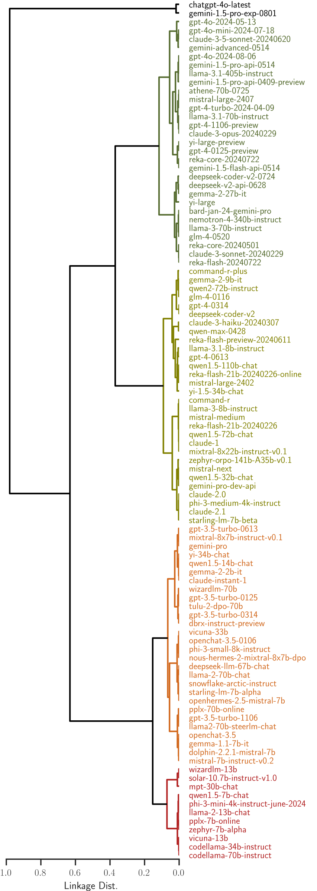

.. module:: leaderbot

|project| Documentation
***********************

|project| is a python package that provides a **leader**\ board for
chat\ **bot**\ s based on `Chatbot Arena <https://lmarena.ai/>`_ project.

.. .. grid:: 4
..
..     .. grid-item-card:: Slides
..         :link: install
..         :link-type: ref
..         :text-align: center
..         :class-card: custom-card-link
..
..     .. grid-item-card:: Poster
..         :link: user_guide
..         :link-type: ref
..         :text-align: center
..         :class-card: custom-card-link
..
..     .. grid-item-card:: Video
..         :link: api
..         :link-type: ref
..         :text-align: center
..         :class-card: custom-card-link
..
..     .. grid-item-card:: Paper
..         :link: https://openreview.net/pdf?id=rAoEub6Nw2
..         :text-align: center
..         :class-card: custom-card-link

.. grid:: 4

    .. grid-item-card:: GitHub
        :link: https://github.com/suquark/leaderbot
        :text-align: center
        :class-card: custom-card-link

    .. grid-item-card:: PyPI
        :link: https://pypi.org/project/leaderbot
        :text-align: center
        :class-card: custom-card-link

    .. grid-item-card:: Quick Usage
        :link: quick_usage
        :link-type: ref
        :text-align: center
        :class-card: custom-card-link

    .. grid-item-card:: API reference
        :link: api
        :link-type: ref
        :text-align: center
        :class-card: custom-card-link

Install
=======

Install with ``pip``:

.. prompt:: bash
    
    pip install leaderbot

Alternatively, clone the source code and install with

.. prompt:: bash
   
    cd source_dir
    pip install .

.. _quick_usage:

Quick Usage
===========

The package provides several statistical ranking models (see
:ref:`API reference <api>` for details). In the example below, we use
:class:`leaderbot.models.Davidson` class to create a model. However, working
with other models is similar.

Create and Train a Model
------------------------

.. code-block:: python

    >>> from leaderbot.data import load
    >>> from leaderbot.models import Davidson

    >>> # Create a model
    >>> data = load()
    >>> model = Davidson(data)

    >>> # Train the model
    >>> model.train()

Leaderboard Table
-----------------

To print leaderboard table of the chatbot agents, use
:func:`leaderbot.models.Davidson.leaderboard` function:

.. code-block:: python

    >>> # Leaderboard table
    >>> model.leaderboard(max_rank=30)

The above code prints the table below:

.. literalinclude:: _static/data/leaderboard.txt
    :language: none

Score Plot
----------

The scores versus rank can be plotted by
:func:`leaderbot.models.Davidson.plot_scores` function:

.. code-block:: python

    >>> model.plot_scores(max_rank=50)

Visualize Correlation
---------------------

The correlation of the chatbot performances can be visualized with
:func:`leaderbot.models.Davidson.map_distance` using various methods. Here is
an example with the Kernel PCA method:

.. code-block:: python

    >>> # Plot kernel PCA
    >>> model.map_distance(max_rank=50, method='kpca', dim='3d')

The above code produces plot below demonstrating the Kernel PCA projection on
three principal axes:

.. image:: _static/images/plots/kpca.png
    :align: center
    :class: custom-dark

Similarly, the correlation distance between competitors can be visualized using
multi-dimensional scaling(MDS)

.. code-block:: python

    >>> # Plot MDS
    >>> model.map_distance(max_rank=50, method='mds', dim='2d')

Hierarchical Clustering
-----------------------

The function :func:`leaderbot.models.Davidson.cluster` performs hierarchical
clustering of the chatbots based on the score and correlation distances:

.. code-block:: python

    >>> # Plot hierarchical cluster
    >>> model.cluster(max_rank=100)

Match Matrices
--------------

The match matrices of the counts or densities of wins and ties can be
visualized with :func:`leaderbot.models.Davidson.match_matrix` function:

.. code-block:: python

    >>> # Match matrix for probability density of win and tie
    >>> model.match_matrix(max_rank=20, density=True)

.. image:: _static/images/plots/match_matrix_density_true.png
    :align: center
    :class: custom-dark

Marginal Outcomes
-----------------

The marginal probabilities (or frequencies) of win, loss, and tie outcomes can
be plotted with :func:`leaderbot.models.Davidson.marginal_outcomes` function:

.. code-block:: python

    >>> # Plot marginal probabilities
    >>> model.marginal_outcomes(max_rank=100)

.. image:: _static/images/plots/rank.png
    :align: center
    :class: custom-dark

Make Inference and Prediction
-----------------------------

Once a model is trained, you can make inference on the probabilities of win,
loss, or tie for a pair of agents using :func:`leaderbot.models.Davidson.infer`
and :func:`leaderbot.models.Davidson.predict` methods:

.. code-block:: python

    >>> # Create a list of three matches using pairs of indices of agents
    >>> matches = list(zip((0, 1, 2), (1, 2, 0)))

    >>> # Make inference
    >>> prob = model.infer(matches)

    >>> # Make prediction
    >>> pred = model.predict(matches)

Model Evaluation
----------------

Performance of multiple models can be compared as follows. First, create a
list of models and train them.

.. code-block:: python

    >>> import leaderbot as lb
    >>> from leaderbot.models import BradleyTerry as BT
    >>> from leaderbot.models import RaoKupper as RK
    >>> from leaderbot.models import Davidson as DV

    >>> # Obtain data
    >>> data = lb.data.load()

    >>> # Create a list of models to compare
    >>> models = [
    ...    BT(data, k_cov=None),
    ...    BT(data, k_cov=0),
    ...    BT(data, k_cov=1),
    ...    RK(data, k_cov=None, k_tie=0),
    ...    RK(data, k_cov=0, k_tie=0),
    ...    RK(data, k_cov=1, k_tie=1),
    ...    DV(data, k_cov=None, k_tie=0),
    ...    DV(data, k_cov=0, k_tie=0),
    ...    DV(data, k_cov=0, k_tie=1)
    ... ]

    >>> # Train models
    >>> for model in models:
    ...    model.train()

Model Selection
...............

Model selection can be performed with
:func:`leaderbot.evaluate.model_selection`:

.. code-block:: python

    >>> # Evaluate models
    >>> metrics = lb.evaluate.model_selection(models, report=True)

The above model evaluation performs the analysis via various metric including
the negative log-likelihood (NLL), cross entropy loss (CEL), Akaike information
criterion (AIC), and Bayesian information criterion (BIC), and prints a report
these metrics the following table:

.. literalinclude:: _static/data/model_selection.txt
    :language: none

Goodness of Fit
...............

The goodness of fit test can be performed with
:func:`leaderbot.evaluate.goodness_of_fit`:

.. code-block:: python

    >>> # Evaluate models
    >>> metrics = lb.evaluate.goodness_of_fit(models, report=True)

The above model evaluation performs the analysis of the goodness of fit using
mean absolute error (MAE), KL divergence (KLD), Jensen-Shannon divergence
(JSD), and prints the following summary table:

.. literalinclude:: _static/data/goodness_of_fit.txt
    :language: none

Generalization
..............

To evaluate generalization, we first train the models on 90% of the data
(training set) and test against the remaining 10% (test set).

.. code-block:: python

    >>> import leaderbot as lb
    >>> from leaderbot.models import BradleyTerry as BT
    >>> from leaderbot.models import RaoKupper as RK
    >>> from leaderbot.models import Davidson as DV

    >>> # Obtain data
    >>> data = lb.data.load()

    >>> # Split data to training and test data
    >>> training_data, test_data = lb.data.split(data, test_ratio=0.2)

    >>> # Create a list of models to compare
    >>> models = [
    ...    BT(training_data, k_cov=None),
    ...    BT(training_data, k_cov=0),
    ...    BT(training_data, k_cov=1),
    ...    RK(training_data, k_cov=None, k_tie=0),
    ...    RK(training_data, k_cov=0, k_tie=0),
    ...    RK(training_data, k_cov=1, k_tie=1),
    ...    DV(training_data, k_cov=None, k_tie=0),
    ...    DV(training_data, k_cov=0, k_tie=0),
    ...    DV(training_data, k_cov=0, k_tie=1)
    ... ]

    >>> # Train models
    >>> for model in models:
    ...    model.train()

We can then evaluate generalization on the test data using
:func:`leaderbot.evaluate.generalization` function:

.. code-block:: python

    >>> # Evaluate models
    >>> metrics = lb.evaluate.generalization(models, test_data, report=True)

The above model evaluation computes prediction error via mean absolute
error (MAE), KL divergence (KLD), Jensen-Shannon divergence
(JSD), and prints the following summary table:

.. literalinclude:: _static/data/goodness_of_fit.txt
    :language: none

Comparing Ranking of Models
...........................

Ranking of various models can be compared using
:func:`leaderbot.evaluate.compare_ranks` function:

.. code-block:: python
    :emphasize-lines: 25

    >>> import leaderbot as lb
    >>> from leaderbot.models import BradleyTerry as BT
    >>> from leaderbot.models import RaoKupper as RK
    >>> from leaderbot.models import Davidson as DV

    >>> # Load data
    >>> data = lb.data.load()

    >>> # Create a list of models to compare
    >>> models = [
    ...     BT(data, k_cov=0),
    ...     BT(data, k_cov=3),
    ...     RK(data, k_cov=0, k_tie=0),
    ...     RK(data, k_cov=0, k_tie=1),
    ...     RK(data, k_cov=0, k_tie=3),
    ...     DV(data, k_cov=0, k_tie=0),
    ...     DV(data, k_cov=0, k_tie=1),
    ...     DV(data, k_cov=0, k_tie=3)
    ... ]

    >>> # Train the models
    >>> for model in models: model.train()

    >>> # Compare ranking of the models
    >>> lb.evaluate.compare_ranks(models, rank_range=[40, 70])

The above code produces plot below.

API Reference
=============

Check the list of functions, classes, and modules of |project| with their
usage, options, and examples.

.. toctree::
    :maxdepth: 2
   
    API Reference <api>

Test
====

You may test the package with `tox <https://tox.wiki/>`__:

.. prompt:: bash

    cd source_dir
    tox

Alternatively, test with `pytest <https://pytest.org>`__:

.. prompt:: bash

    cd source_dir
    pytest

How to Contribute
=================

We welcome contributions via GitHub's pull request. Developers should review
our :ref:`Contributing Guidelines <contribute>` before submitting their code.
If you do not feel comfortable modifying the code, we also welcome feature
requests and bug reports.

.. How to Cite
.. include:: cite.rst

License
=======

|license|

.. |license| image:: https://img.shields.io/github/license/suquark/leaderbot
   :target: https://opensource.org/licenses/BSD-3-Clause
.. |pypi| image:: https://img.shields.io/pypi/v/leaderbot
.. |traceflows-light| image:: _static/images/icons/logo-leaderbot-light.svg
   :height: 23
   :class: only-light
.. |traceflows-dark| image:: _static/images/icons/logo-leaderbot-dark.svg
   :height: 23
   :class: only-dark
